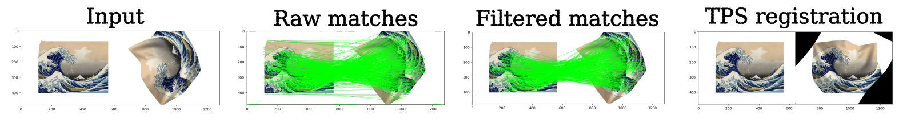
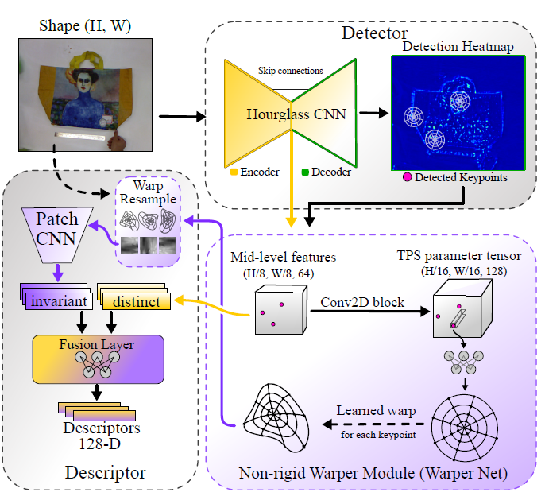
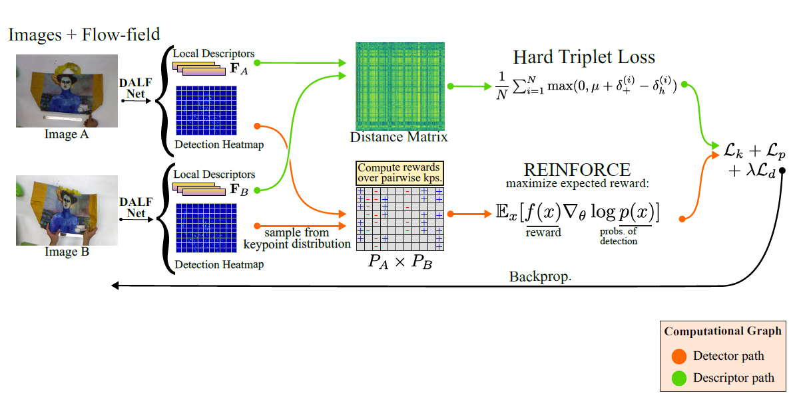

# DALF: Deformation-Aware Local Features
[](LICENSE)
[](https://colab.research.google.com/github/verlab/DALF_CVPR_2023/blob/main/notebooks/registration_with_DALF.ipynb)



<div align="center">
 <br>
DALF registration with challenging deformation + illumination + rotation transformations. <br><br>
</div>

**TL;DR**: A joint image keypoint detector and descriptor for handling non-rigid deformation. Also works great under large rotations. 

Just wanna quickly try in your images? Check this out: [](https://colab.research.google.com/github/verlab/DALF_CVPR_2023/blob/main/notebooks/registration_with_DALF.ipynb)

## Table of Contents
- [Introduction](#introduction) 
- [Requirements](#requirements)
- [Installation](#installation)
- [Usage](#usage)
  - [Training](#training)
  - [Inference](#inference)
  - [Evaluation](#evaluation)
- [Applications](#applications)
- [Citation](#citation)
- [License](#license)
- [Acknowledgements](#acknowledgements)


## Introduction
This repository contains the official implementation of the paper: *[Enhancing Deformable Local Features by Jointly Learning to Detect and Describe Keypoints](https://arxiv.org/abs/2304.00583)*, to be presented at CVPR 2023.

**Abstract**: Local feature extraction is a standard approach in computer vision for tackling important tasks such as image matching and retrieval. The core assumption of most methods is that images undergo affine transformations, disregarding more complicated effects such as non-rigid deformations. Furthermore, incipient works tailored for non-rigid correspondence still rely on keypoint detectors designed for rigid transformations, hindering performance due to the limitations of the detector. We propose DALF (Deformation-Aware Local Features), a novel deformation-aware network for jointly detecting and describing keypoints, to handle the challenging problem of matching deformable surfaces. All network components work cooperatively through a feature fusion approach that enforces the descriptors’ distinctiveness and invariance. Experiments using real deforming objects showcase the superiority of our method, where it delivers 8% improvement in matching scores compared to the previous best results. Our approach also enhances the performance of two real-world applications: deformable object retrieval and non-rigid 3D surface registration.

**Overview of DALF achitecture**
Our architecture jointly optimizes non-rigid keypoint detection and description, and explicitly models local deformations for descriptor extraction during training. An hourglass CNN computes a dense heat map providing specialized keypoints that are used by the Warper Net to extract deformation-aware matches. A feature fusion layer balances the trade-off between invariance and distinctiveness in the final descriptors. DALF network is used to produce a detection heatmap and a set of local features for each image. In the detector path, the heatmaps are optimized via the REINFORCE algorithm considering keypoint repeatability under deformations. In the descriptor path, feature space is learned via the hard triplet loss. A siamese setup using image pairs is employed to optimize the network.




## Requirements
- [conda](https://docs.conda.io/en/latest/miniconda.html) for automatic installation;

## Installation
Tested on Ubuntu 18, 20, and 22.
Clone the repository, and build a fresh conda environment for DALF:
```bash
git clone https://github.com/yourusername/DALF.git
cd DALF
conda env create -f environment.yml -n dalf_env
conda activate dalf_env
```

### Manual installation
In case you just want to manually install the dependencies, first install [pytorch (>=1.12.0)](https://pytorch.org/get-started/previous-versions/) and then the rest of depencencies:
```bash
#For GPU (please check your CUDA version)
pip install torch==1.12.0+cu102 torchvision==0.13.0+cu102 torchaudio==0.12.0 --extra-index-url https://download.pytorch.org/whl/cu102
#CPU only
pip install torch==1.12.0+cpu torchvision==0.13.0+cpu torchaudio==0.12.0 --extra-index-url https://download.pytorch.org/whl/cpu

pip install --user numpy scipy opencv-contrib-python kornia
```

## Usage

For your convenience, we provide ready to use notebooks for some tasks.

|            **Description**     |  **Notebook**                     |
|--------------------------------|-------------------------------|
| Matching example | [](https://colab.research.google.com/github/verlab/DALF_CVPR_2023/blob/main/notebooks/registration_with_DALF.ipynb) |
| Register a video of deforming object (as shown in the GIF)| [](https://colab.research.google.com/github/verlab/DALF_CVPR_2023/blob/main/notebooks/video_registration_with_DALF.ipynb) |
| Download data and train from scratch | [](https://colab.research.google.com/github/verlab/DALF_CVPR_2023/blob/main/notebooks/train_DALF_from_scratch.ipynb) |


### Inference
To run DALF on an image, three lines of code is enough:
```python
from modules.models.DALF import DALF_extractor as DALF
import torch
import cv2

dalf = DALF(dev=torch.device('cuda' if torch.cuda.is_available else 'cpu'))

img = cv2.imread('./assets/kanagawa_1.png')

kps, descs = dalf.detectAndCompute(img)
```
Or you can use this [script](./run_dalf.py) in the root folder:
```bash
python3 run_dalf.py
```

### Training
DALF can be trained in a self-supervised manner with synthetic warps (see [augmentation.py](modules/dataset/augmentation.py)), i.e., one can use a folder with random images for training. In our experiments, we used the raw images (without any annotation) of 1DSfM datasets which can be found in [this link](https://www.cs.cornell.edu/projects/1dsfm/).
To train DALF from scratch on a set of arbitrary images with default parameters, run the following command:
```bash
python3 train.py
```
To train the model, we recommend a machine with a GPU with at least 10 GB memory, and 16 GB of RAM. You can attempt to reduce the batch size and increase the number of gradient accumulations accordingly, to train in a GPU with less than 10 GB.
We provide a Colab to demonstrate how to train DALF from scratch: [](https://colab.research.google.com/github/verlab/xx/xx.ipynb). While it is possible to train the model on Colab, it should take more than 48 hours of GPU usage.

### Evaluation
We follow the same protocol and benchmark evaluation of [DEAL](https://github.com/verlab/DEAL_NeurIPS_2021#vi---evaluation). You will need to [download the non-rigid evaluation benchmark files](https://www.verlab.dcc.ufmg.br/descriptors/#datasets). Then, run the [evaluation script](eval/eval_nonrigid.sh):
```bash
sh ./eval/eval_nonrigid.sh
```
Please update the variables ``PATH_IMGS`` and ``PATH_TPS`` to point to your downloaded benchmark files before running the evaluation script!

## Applications

The image retrieval and non-rigid surface registration used in the paper will be released very soon in a new repository focused on application tasks involving local features. Stay tuned!

The video below show the non-rigid 3D surface registration results from the paper:
<p align="center">
  <a href="https://www.youtube.com/watch?v=7-wDqrhn33Y"></a>
</p>

## Citation
If you find this code useful for your research, please cite the paper:

```bibtex
@INPROCEEDINGS{potje2023cvpr,
  author={Guilherme {Potje} and and Felipe {Cadar} and Andre {Araujo} and Renato {Martins} and Erickson R. {Nascimento}},
  booktitle={2023 IEEE / CVF Computer Vision and Pattern Recognition (CVPR)}, 
  title={Enhancing Deformable Local Features by Jointly Learning to Detect and Describe Keypoints}, 
  year={2023}}
```

## License
[](LICENSE)

## Acknowledgements
- We thank [Christoph Heindl](https://github.com/cheind/py-thin-plate-spline), and the authors of [DISK](https://github.com/cvlab-epfl/disk) and [HardNet](https://github.com/DagnyT/hardnet) for releasing their code, which inspired our work.
- We thank the developers of Kornia for developing and releasing the amazing [kornia library](https://github.com/kornia/kornia)!
- We thank the agencies CAPES, CNPq, FAPEMIG, and Google for funding different parts of this work.

**VeRLab:** Laboratory of Computer Vison and Robotics https://www.verlab.dcc.ufmg.br
<br>


<br/>

